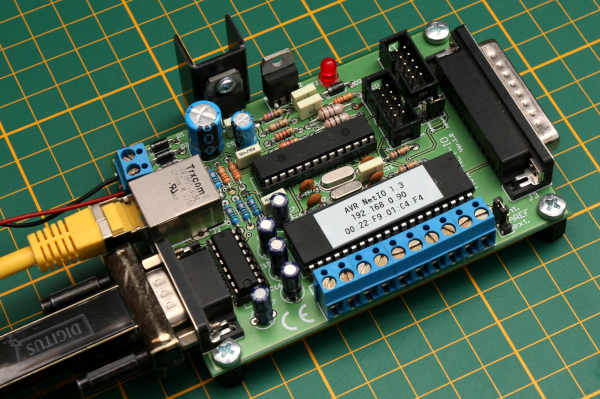
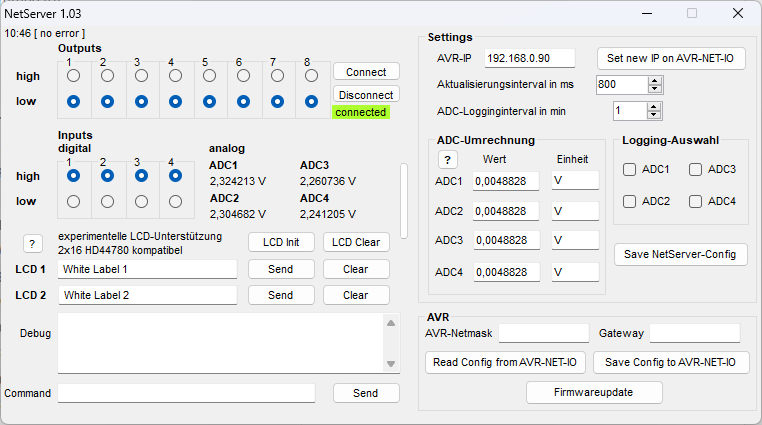
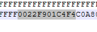

# Pollin NetIO Clone
> [!WARNING]  
> The original design is flawed in many ways. If you want to build this design, you should be prepared for some disappointment!
> If you know what you're doing, go ahead. Otherwise you might want to wait for the improved version.

This is a clone of the original Pollin NetIO board.

## Versions
### Original

* As identical as possible to the original
* outline and placement of the components as close as possible
* Assembly plan of the original works

### Improved (tbd)
* Mechanical identical
* Added capacitors and diodes for stability
* placement of the components as close to the original as possible

Things to improve:
* ATmega32 to 3V3? -> Consider compability of extensions
* More capacitors for the ENC28J60
* Diode + capacitors for the LM317
* Connect RS232 handshake lines -> Arduino bootloader compatible

## Software
The original Pollin Netserver 1.03 (provided on a CD) is in /Software/Netserver.zip

It works just fine with Windows 11.

## Firmware
The original firmware is included.

The MAC address is stored in the EEPROM and can be modified in the .eep file:

So this is MAC address 00:22:F9:01:C4:F4

## Resources
EEPROM Structure: https://www.mikrocontroller.net/topic/112937#1016995

Hardware improvements: https://community.symcon.de/t/p-llins-avr-net-io-langzeitstabilitaet-des-lan-chips/24317/12

General: https://www.mikrocontroller.net/articles/AVR_Net-IO_Bausatz_von_Pollin

## Disclaimer
> [!CAUTION]
> This project was created to archive and preserve the NetIO PCB. Pollin owns all the rights to this design.
> There's no copyright infringement intended, please contact me for removal.