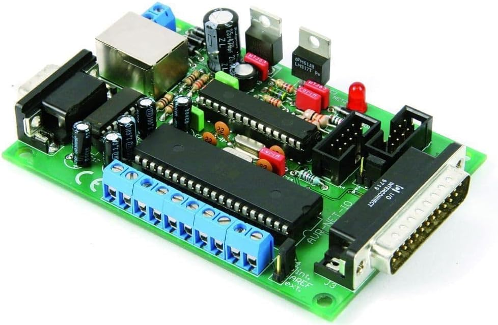
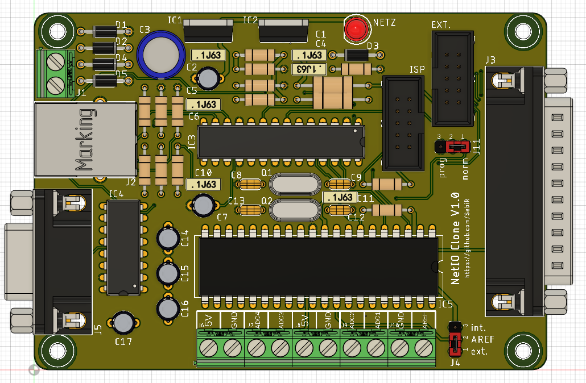
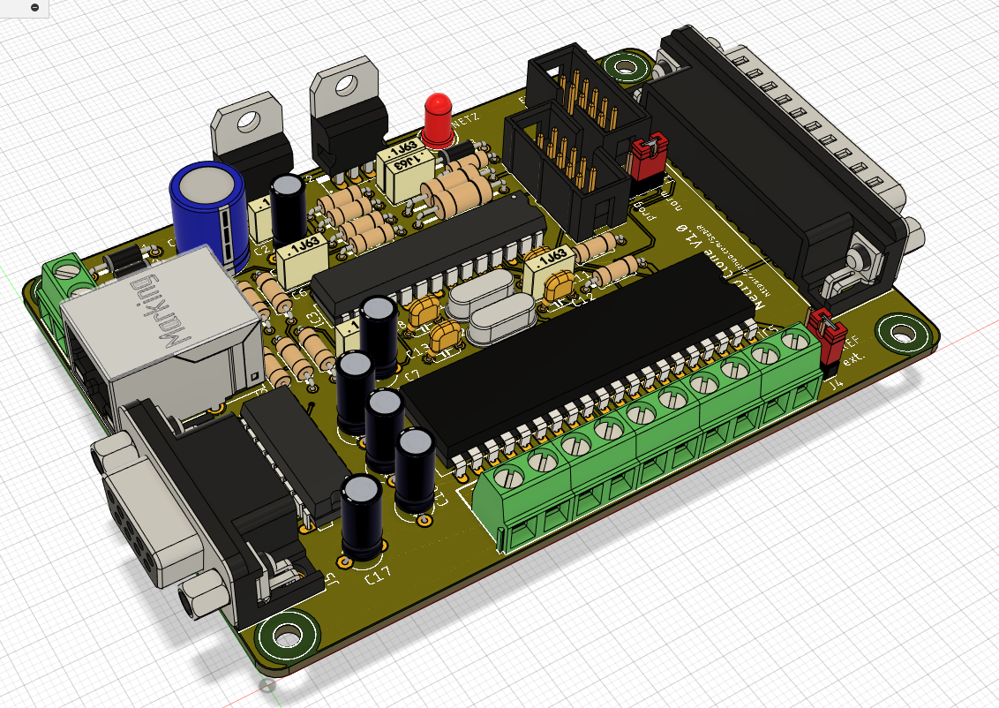

# Pollin NetIO Clone
This is a clone of the original Pollin NetIO board.

## Versions
### Original
* As identical as possible to the original
* outline and placement of the components as close as possible
* Assembly plan of the original works

### Improved (tbd)
* Mechanical identical
* Added capacitors and diodes for stability
* placement of the components as close to the original as possible

## Firmware
The original firmware is included.

The MAC address is stored in the EEPROM and can be modified in the .eep file:

So this is MAC address 00:22:F9:01:C4:F4

## Disclaimer
This project was created to archive and preserve the NetIO PCB. Pollin owns all the rights to this design.
There's no copyright infringement intended, please contact me for removal if I cause any problems.